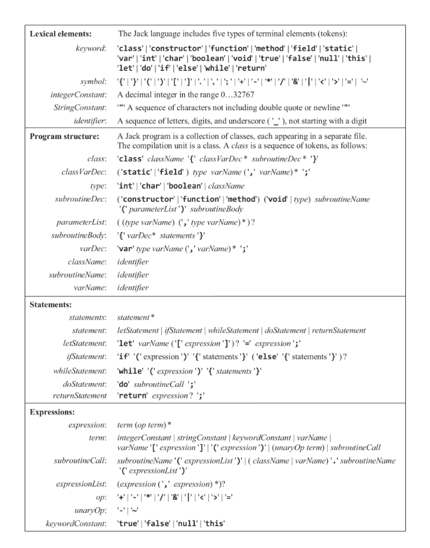

# Project 10: Tokenizer & Parser

A Python-based Tokenizer & Parser for the Jack Language that converts Jack to XML output.

## Usage

```bash
python Project10.py <filename.vm OR folder>
```

This generates a `.xml` and `T.xml` file beginning with the same name as the `.vm` file in the same directory. If the input is a folder, then two files will be created for each `.vm` file in that folder.

## Tokenizer Class

- **Parameters**: `file_path` (string) - The path to the `.vm` file to be tokenized, `output_file` (string) - The path where the output XML file will be saved.
- **Important Variables**: `tokens` - A list of tuples (lexical element, string) that will be generated by the tokenizer and used by the parser.

### Functions & Class Structure

| Function                                             | Description                                                                                                                                                                                                                                                                                                                                                      |
| ---------------------------------------------------- | ---------------------------------------------------------------------------------------------------------------------------------------------------------------------------------------------------------------------------------------------------------------------------------------------------------------------------------------------------------------- |
| `tokenize(self)`                                     | The main function of this class. When called, it will read from `file_path`, call `tokenize_lines`, and return a list of tuples (lexical element, string)                                                                                                                                                                                                        |
| `tokenize_lines(self, lines)`                        | Takes a list of lines from the input file and tokenizes them, returning a list of tuples (lexical element, string). This is the most important function. It loops through the file line by line and character by character, keeping track of whether you are in a string, comment, and whether a word has ended. If a word has ended, it calls `endCurrentWord`. |
| `endCurrentWord(self, currentWord, tokens)`          | Helper function for tokenizer: Classify the current word as keyword/identifier/integerConstant and add it to the list of tokens.                                                                                                                                                                                                                                 |
| `print_tokens_to_xml(self, all_tokens, output_file)` | Optional helper function. Takes in a list of tuples (lexical element, string) and prints them to an XML file with the given name, handling special characters. Should be called after `tokenize`.                                                                                                                                                                |

## Parser Class

- **Parameters**: `tokens` (list of tuples) - The list of tokens to be parsed, `output_file` (string) - The path where the output XML file will be saved.
- **Important Variables**: `i` (int) - The index of the current token being processed in the list of tokens, `indent_level` (int) - The current indentation level for XML output.

### Helper Functions

| Function                                                           | Description                                                                                                                                                                  |
| ------------------------------------------------------------------ | ---------------------------------------------------------------------------------------------------------------------------------------------------------------------------- |
| `get_current_token()`                                              | Returns the current token from the list of tokens.                                                                                                                           |
| `advance()`                                                        | Advances the index to the next token.                                                                                                                                        |
| `peek()`                                                           | Returns the next token without advancing the index.                                                                                                                          |
| `write_line(line)`                                                 | Writes a line to the XML output file with proper indentation.                                                                                                                |
| `consume_and_print_token(expected_type=None, expected_value=None)` | Checks that the current token is of the expected type/value (if provided), prints it to the XML file (using `write_line`), and advances to the next token (using `advance`). |

## Compilation Functions

These functions are responsible for compiling different parts of the Jack language syntax. Each function corresponds to a specific grammar rule in the Jack language specification. They follow the naming convention `compile<GrammarRule>`, where `<GrammarRule>` is the name of the grammar rule being compiled. For example, `compileClass` compiles a class declaration, `compileSubroutine` compiles a subroutine declaration, and so on.Please see the photo below for a list of grammar rules. Each function uses the helper functions from the Parser class to consume tokens, check for expected types/values, and write the appropriate XML output. It also uses recursion to handle nested structures in the Jack language syntax.


