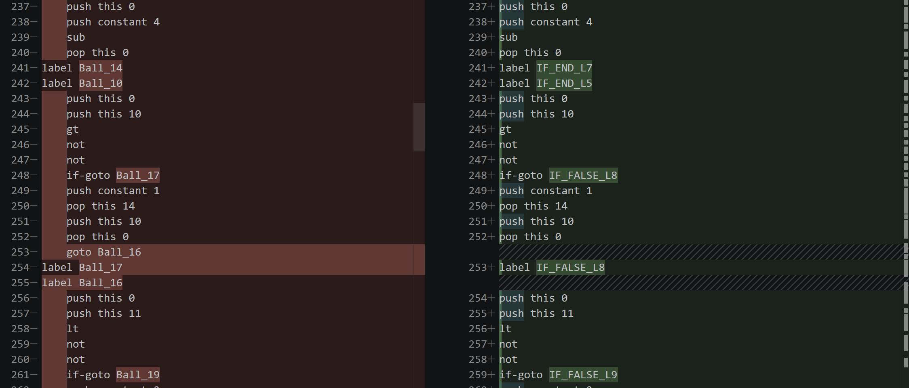

# Project 11: Compilation Engine

A Python-based Tokenizer & Parser, and Compiler for the Jack Language that converts Jack to XML output.

## Usage

```bash
python Project11.py <filename.jack OR folder>
```

This generates a `.TAarav.xml` and `Aarav.vm` file beginning with the same name as the `.jack` file in the same directory. If the input is a folder, then two files will be created for each `.jack` file in that folder.

## Tokenizer Class

Read the Project 10 README for the Tokenizer class, which is the same for this project.

## SymbolTable Class

The SymbolTable class is responsible for keeping track of variable names, their types, their kind (static, field, argument, or local), and their index within that kind. It has functions for defining new variables, looking up existing variables, and keeping track of how many variables of each kind have been defined so far.

The Parser creates two instances of the SymbolTable class: one for class-level variables (static and field) and one for subroutine-level variables (argument and local).

## VM Writer Functions

The VM writer functions are helper functions that write the appropriate VM code to the output file for different operations. They include functions for writing push and pop commands, arithmetic commands, label commands, goto commands, if-goto commands, call commands, and function commands. These functions take in the necessary parameters (such as segment and index for push/pop commands) and write the corresponding VM code to the output file. These functions are used throughout the Parser class when compiling different parts of the Jack language syntax to generate the correct VM code and improve code readability.

## Parser Class

For an in-depth explanation of the Parser class, please see the Project 10 README. The Parser class for this project has been modified to generate VM code instead of XML output. It uses the SymbolTable class to keep track of variable information and the VM writer functions to write the appropriate VM code to the output file as it compiles different parts of the Jack language syntax. The overall structure and helper functions of the Parser class remain the same as in Project 10, but the compilation functions have been updated to generate VM code.

## Compilation Notes

This section will provide brief notes on compiling different parts of the Jack language syntax to VM code. For a more detailed explanation of how each part is compiled, please see the comments in the `Project11.py` file.

### Compiling Variables

When compiling variable declarations, we use the `define` function of the SymbolTable class to add the variable to the symbol table with its type, kind, and index. For field variables, we treat them as "this" in the VM code since they are accessed with the "this" segment. For other variables, we keep their kind as is (static, argument, or local). We also keep a counter for each kind of variable to assign the correct index when defining new variables. To read a variable, we use the `lookup_variable` function to get its information from the symbol table and then write the appropriate VM code to push its value onto the stack. If it's an array variable, we need to do special handling, which is specified below.

### Compiling Arrays

When compiling array access, we first push the base address of the array onto the stack, then compile the expression inside the brackets to get the index and push that onto the stack as well. We then add the base address and index together to get the target address. For reading from an array, we pop that target address into pointer 1 (that means "that" now points to the target array element) and then push the value at that address onto the stack. For writing to an array, we compile the expression for the value to assign and push it onto the stack, then pop it into "that 0" to assign it to the target array element.

### Compiling Expressions

When compiling expressions, we use postfix notation to handle operator precedence. We first compile the term, then we check if there are any operators. If there are, we compile the next term and then write the appropriate VM code for the operator. We repeat this process until there are no more operators left in the expression. Unfortunately, this means that there is no way to directly handle operator precedence, but we assume (and hope) that all expressions are properly parenthesized, so we can rely on the parentheses to ensure that operators are evaluated in the correct order.

### Compiling Strings

When compiling string constants, we first push the length of the string onto the stack and call `String.new` to create a new string object. We then loop through each character in the string, push its ASCII value onto the stack, and call `String.appendChar` to append it to the string object. This way, we can construct the entire string in the VM code.

### Compiling Statements

When compiling statements, we must use different methods depending on the statement type. 

For **do statements**, we just need to ignore the return value. 

For **return statements**, if there is an expression to return, we compile it and then write a `return` command. If there is no expression (i.e. it's just `return;`), we push 0 onto the stack and then write a `return` command to return void.

For **let statements**, we need to handle both regular variable assignment and array assignment (as described above). 

For **if statements**, we need to generate unique labels for the true and false branches and write the appropriate VM code for the if-goto commands for branching by negating the condition and jumping to the "false" label if necessary. For **while statements**, we also need to generate unique labels for the start and end of the loop and write the appropriate VM code for the goto commands, double-checking the condition on each loop iteration.

**NOTE**: For if statements, the testing code from Nand2Tetris does not directly line up with my generated code. This seems to be because they generate an extra label for the end of the if-statement, whereas I just generate a label for the false branch and then use the natural flow of the program to continue. However, the rest of my code follows all specifications. I have included a screenshot of the Nand2Tetris generated code (left) vs. my generated code (right) for an if statement in `Ball.vm` to show the difference. The Nand2Tetris code unconditionally jumps to the `Ball_16` label, while my code just moves past the `IF_FALSE_L8` label and moves on. There seems to be no purpose to skipping the `Ball_17` label, unless I've made a misjudgement (which is very possible!).

